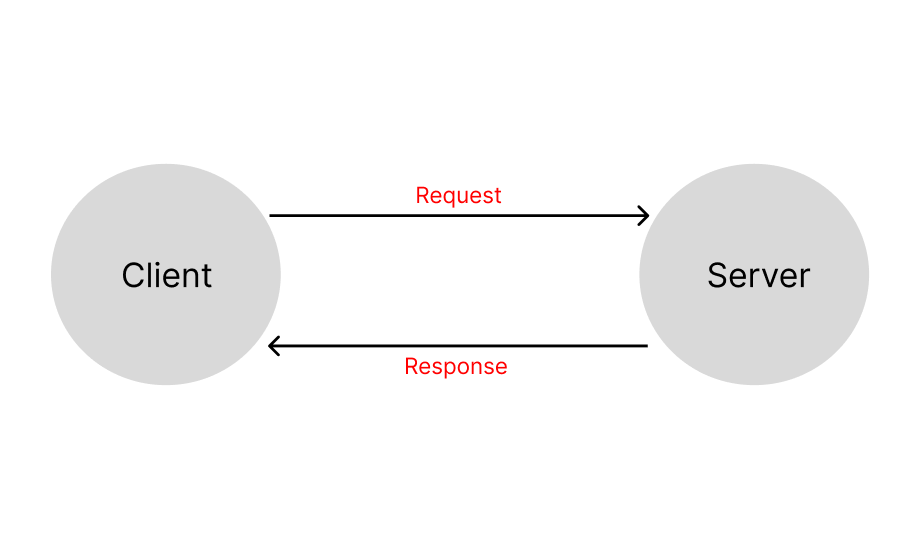
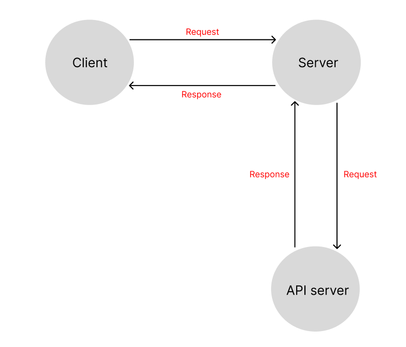
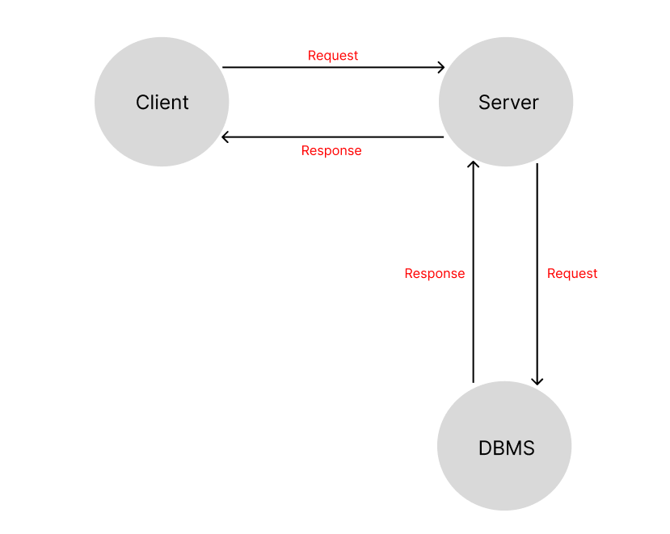

# Movies-Library

**Esmail Jawabreh**

## WRRC Lab-11

## WRRC Lab-12

## WRRC Lab-13

## Overview
### the Home Page Endpoint gets data from json file and shows specific data from it,
### the Favorite Page Endpoint shows only "Welcome to Favorite Page",
### the Trending Page Endpoint gets data from API and shows the trending movies information,
### the Search Page Endpoint gets data from API and shows all movies,
### the add Movie page Endpoint post request to save a specific movie to database,
### and the get Movies page Endpoint Create a get request to get all the data from the database.
 
## Getting Started
## What are the steps that a user must take in order to build this app on their own machine and get it running? 
###
## 1- Install Node.js: 
### Node.js is a JavaScript runtime that allows you to run JavaScript code outside of a browser. 
### Install it on your machine by downloading and running the installer.
###
## 2-Clone the source code: 
### Clone the source code for the movie app's server from a code repository, such as GitHub. 
###
## 3-Install dependencies: 
### Navigate to the root directory of the server code, 
### and install its dependencies by running the command (npm install) in your terminal.
###
## 4-Set up the database: 
### If the movie app server relies on a database, you will need to set it up.
### Follow the database's documentation to install and configure it appropriately.
###
## 5-Configure the server: 
### Create a .js file in the root directory of the server code to hold environment variables that the server uses to operate. 
### For example: you may need to specify the port on which the server listens for incoming requests. 
###
## 6- Start the server: 
### Run the command npm start in the terminal to start the server. 
### This should launch the server and enable it to receive requests from clients.
###
## 7- Test the server: 
## To confirm that the server is running as expected, you can test it by sending a request to it using a tool like Postman. 
## Consult the server code's documentation to know what endpoints are available and how to format the requests.

## Project Features
## What are the features included in you app?
###
### my web server include support for JavaScript,
### and two functions to handle error 404 and 500.